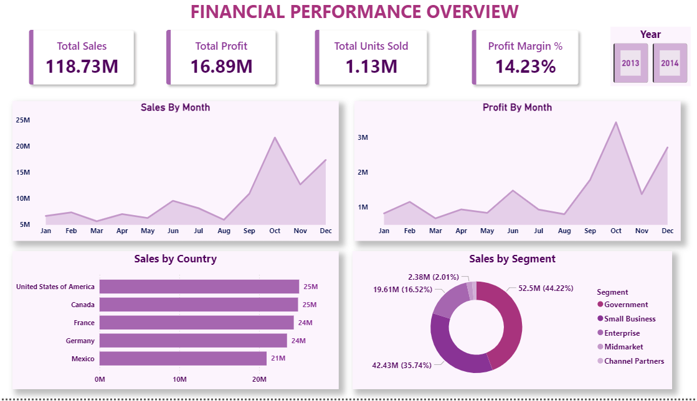
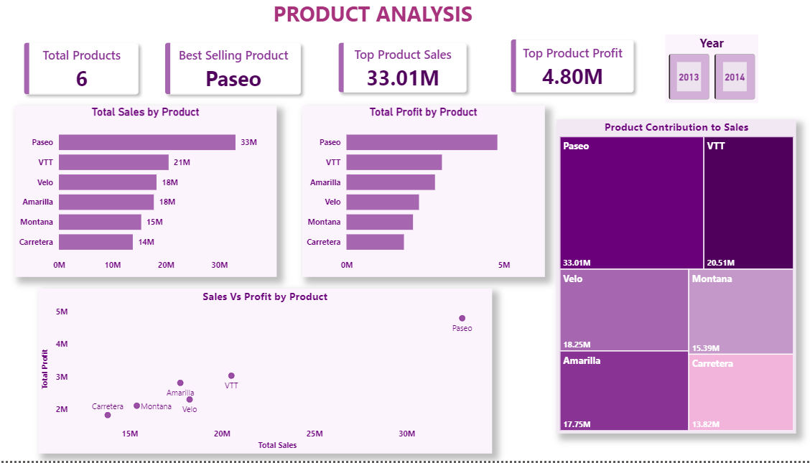
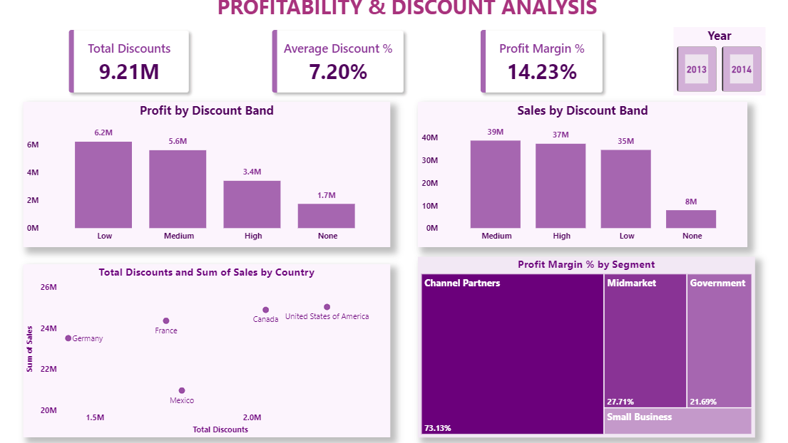

# 📊 Financial Performance Dashboard | Power BI

## 📌 Project Overview

This project presents an interactive **Financial Performance Dashboard** developed in **Power BI** using the Microsoft Financial Sample dataset. The dashboard provides comprehensive insights into sales performance, product profitability, customer segments, discount strategies, and overall business performance.

The objective of this project is to transform raw financial data into actionable business insights through data modeling, DAX calculations, and interactive visualizations.

---

## 🎯 Project Objectives

- Analyze overall sales and profit performance.
- Identify top-performing products and business segments.
- Evaluate the impact of discounts on profitability.
- Compare sales performance across countries.
- Build an interactive dashboard for business decision-making.

---

## 🛠️ Tools & Technologies

- **Power BI Desktop**
- **Power Query**
- **DAX (Data Analysis Expressions)**
- **Data Modeling**
- **Data Visualization**

---

## 📂 Dataset

**Microsoft Financial Sample Dataset**

The dataset contains financial transactions across multiple countries, products, segments, and discount bands.

### Key Fields

- Date
- Product
- Segment
- Country
- Units Sold
- Sales
- Gross Sales
- Discounts
- COGS
- Profit
- Discount Band

---

# 📈 Dashboard Pages

## 1️⃣ Financial Performance Overview

Provides a high-level view of business performance through key KPIs and trend analysis.

### KPIs
- Total Sales
- Total Profit
- Units Sold
- Profit Margin %

### Visuals
- Monthly Sales Trend
- Monthly Profit Trend
- Sales by Country
- Sales by Segment

### Dashboard Preview



---

## 2️⃣ Product Analysis

Focuses on product-level performance and profitability.

### KPIs
- Best Selling Product
- Top Product Sales
- Top Product Profit

### Visuals
- Sales by Product
- Profit by Product
- Product Contribution Treemap
- Sales vs Profit Scatter Plot

### Dashboard Preview



---

## 3️⃣ Profitability & Discount Analysis

Analyzes the relationship between discounts, sales, and profitability.

### KPIs
- Total Discounts
- Average Discount %
- Profit Margin %

### Visuals
- Profit by Discount Band
- Sales by Discount Band
- Sales vs Discounts by Country
- Profit Margin by Segment

### Dashboard Preview



---

# 💡 Key Insights

### Product Performance
- **Paseo** emerged as the highest-performing product in terms of both sales and profit.
- Product profitability varies significantly across the portfolio.

### Sales Performance
- The **Government** segment contributes the largest share of overall sales.
- Sales trends reveal strong seasonal fluctuations throughout the year.

### Profitability Analysis
- Lower discount levels generally generate higher profit margins.
- Higher discounts increase sales volume but may reduce profitability.

### Geographic Performance
- **United States** and **Canada** are the strongest revenue-generating markets.

---

# 📊 DAX Measures Used

```DAX
Total Sales = SUM(Financials[Sales])

Total Profit = SUM(Financials[Profit])

Profit Margin % =
DIVIDE([Total Profit],[Total Sales])

Total Units Sold =
SUM(Financials[Units Sold])
```

---

# 📁 Repository Structure

```text
Financial-Performance-Dashboard/
│
├── Financial_Performance_Dashboard.pbix
├── Financials.xlsx
├── README.md
│
├── Dashboard_Screenshots/
│   ├── page1_financial_overview.png
│   ├── page2_product_analysis.png
│   └── page3_profitability_analysis.png

```

---

# 🚀 Skills Demonstrated

- Data Cleaning using Power Query
- Data Modeling
- DAX Calculations
- KPI Development
- Dashboard Design
- Data Storytelling
- Business Intelligence Reporting

---

# 📌 Conclusion

This dashboard successfully transforms financial data into meaningful business insights through interactive visualizations and analytical reporting. It demonstrates practical Power BI skills including data preparation, DAX development, dashboard design, and business-focused storytelling.

---

## 👨‍💻 Author

**Sajja Yasodha Krishna**

Power BI | Data Analytics | Business Intelligence
